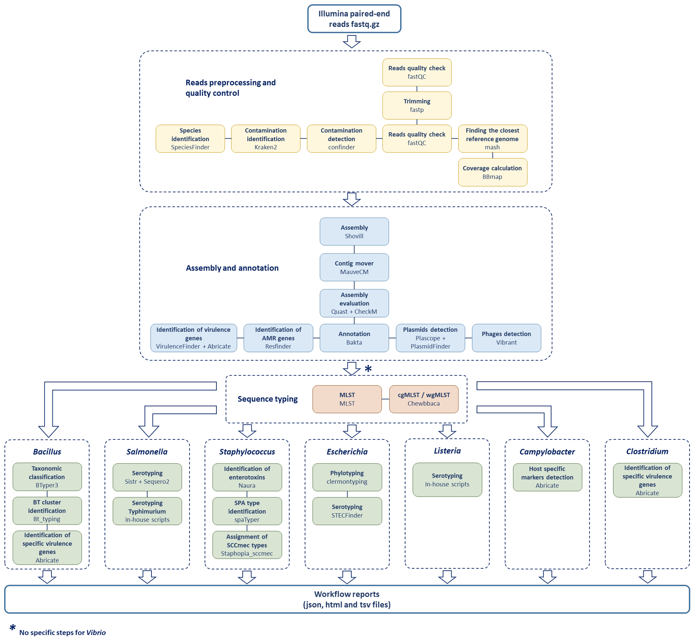

# Bacwork, an integrated workflow designed for flexible analysis of sequencing data of food bacterial pathogens


## Table of Contents

- [Description](#Description)
- [Citation](#Citation)
- [Installation](#Installation)
  - [Requirements](#Requirements)
  - [Download from source](#Download-from-source)
- [Database Setup](#Database-Setup)
  - [Database of complete reference genomes](#Database-of-complete-reference-genomes)
  - [Confindr rMLST database](#Confindr-rMLST-database)
  - [Speciesfinder database](#Speciesfinder-database)
  - [Kraken2 database](#Kraken2-database)
  - [Resfinder, Pointfinder, disinfinder, virulencefinder and plasmidfinder databases](#Resfinder,-Pointfinder,-disinfinder,-virulencefinder-and-plasmidfinder-databases)
  - [Vibrant database](#Vibrant-database)
  - [Bakta database](#Bakta-database)
  - [Busco database](#Busco-database)
  - [Species-specific Plascope databases](#Species-specific-Plascope-databases)
  - [Chewbbaca databases](#Chewbbaca-databases)
- [Usage](#Usage)
  - [Bacterial species compatible](#Bacterial-species-compatible)
  - [Configuration](#Configuration)
    - [config.json](#config.json)
    - [config_tools.json](#config_tools.json)
    - [config_path.json](#config_path.json)
    - [config_quality.json](#config_quality.json)
  - [Execution](#Execution)
  - [Workflow Test](#Workflow-Test)
- [Results](#Results)
  - [Results Directory Structure](#Results-Directory-Structure)
  - [JSON output files](#JSON-output-files)
- [License](#License)


## Description

Bacwork is an automated Snakemake-based workflow designed for the primary and secondary analysis of bacterial paired-end Illumina® sequencing data. It inherently documents pipeline steps, inputs, and outputs.

To ensure reproducibility, facilitate deployment, and prevent issues related to missing or mismatched dependencies, it utilizes [mamba](https://github.com/mamba-org/mamba) environments for each analysis step. The workflow is organized into modules, which can be either common or pathogen-specific.

Each module and tool implemented in the workflow is described in the following figure:


## Citation

coming soon

## Installation

### Requirements

* **python 3** (tested with 3.10.10)
* **conda** (tested with 23.3.0)
* **mamba** (tested with 1.4.1)
* **snakemake** (tested with 7.25.0)


### Download from source

To install the latest version of Bacwork, please clone the git repository on your system.

```shell
cd <path_to_installation>
git clone XXX
```

## Database Setup

**Note** : You can create a `VERSION` file in the database directories to ensure database version traceability. This file will be recognized and managed by Bacwork.

### Database of complete reference genomes

Installation of [ncbi-genome-download](https://github.com/kblin/ncbi-genome-download) and [mash](https://github.com/marbl/Mash) packages :
```shell
mamba create -n mash_db_env ncbi-genome-download mash
mamba activate mash_db_env 
```
Download complete genomes for each pathogen of interest :
```shell
ncbi-genome-download --parallel 16 --formats fasta --assembly-levels complete bacteria -g bacillus -r 100
ncbi-genome-download --parallel 16 --formats fasta --assembly-levels complete bacteria -g Salmonella -r 100
ncbi-genome-download --parallel 16 --formats fasta --assembly-levels complete bacteria -g Staphylococcus -r 100
ncbi-genome-download --parallel 16 --formats fasta --assembly-levels complete bacteria -g Escherichia -r 100
ncbi-genome-download --parallel 16 --formats fasta --assembly-levels complete bacteria -g Listeria -r 100
ncbi-genome-download --parallel 16 --formats fasta --assembly-levels complete bacteria -g campylobacter -r 100
ncbi-genome-download --parallel 16 --formats fasta --assembly-levels complete bacteria -g Clostridioides -r 100
ncbi-genome-download --parallel 16 --formats fasta --assembly-levels complete bacteria -g Clostridium -r 100
ncbi-genome-download --parallel 16 --formats fasta --assembly-levels complete bacteria -g Vibrio -r 100

mkdir NCBI_complete_bacterial_genomes_$(date +%Y%m%d)

find refseq/bacteria/* -name "*fna.gz" -maxdepth 2 -type f -print0 | \
xargs -0 mv -t NCBI_complete_bacterial_genomes_$(date +%Y%m%d)/

find NCBI_complete_bacterial_genomes_$(date +%Y%m%d)/ -name "*" -type f -print0 | xargs -0 gunzip

rm -r refseq/
```
Creating the mash sketch database :
```shell
mash sketch -p 16 -k 15 -i NCBI_complete_bacterial_genomes_$(date +%Y%m%d)/* \
-o NCBI_complete_bacterial_genomes_$(date +%Y%m%d).msh
```
### Confindr rMLST database

To download the [confindr](https://github.com/OLC-Bioinformatics/ConFindr) database, please follow the procedure described [here](https://olc-bioinformatics.github.io/ConFindr/install/#downloading-confindr-databases). 

### Speciesfinder database

To download and install the [speciesfinder](https://bitbucket.org/genomicepidemiology/speciesfinder/src/master/) database, please follow the procedure described [here](https://bitbucket.org/genomicepidemiology/speciesfinder/src/master/). 

### Kraken2 database

We recommend using the [Kraken2](https://github.com/DerrickWood/kraken2) standard-16 database, available at this [link](https://benlangmead.github.io/aws-indexes/k2).

### Resfinder, Pointfinder, disinfinder, virulencefinder and plasmidfinder databases

To download and install these databases, follow these steps:

```bash
mamba create -n kma kma
mamba activate kma

# Install resfinder database
git clone https://bitbucket.org/genomicepidemiology/resfinder_db/
cd resfinder_db/
python3 INSTALL.py

# Install pointfinder database
git clone https://bitbucket.org/genomicepidemiology/pointfinder_db/
cd pointfinder_db/
python3 INSTALL.py

# Install disinfinder database
git clone https://bitbucket.org/genomicepidemiology/disinfinder_db/
cd disinfinder_db/
python3 INSTALL.py

# Install virulencefinder database
git clone https://bitbucket.org/genomicepidemiology/virulencefinder_db/
cd virulencefinder_db/
python3 INSTALL.py

# Install plasmidfinder database
git clone https://bitbucket.org/genomicepidemiology/plasmidfinder_db.git
cd plasmidfinder_db
python3 INSTALL.py kma_index

``` 

### Vibrant database

To download and install [Vibrant](https://github.com/AnantharamanLab/VIBRANT) databases, follow these steps:

```shell
mamba install vibrant
git clone https://github.com/AnantharamanLab/VIBRANT.git
cd VIBRANT/databases/
# modify third parties databases because links in VIBRANT_setup.py are not up-to-date
wget https://ftp.ebi.ac.uk/pub/databases/Pfam/current_release/Pfam-A.hmm.gz
wget https://www.genome.jp/ftp/db/kofam/archives/2024-05-01/profiles.tar.gz
python VIBRANT_setup.py
```

### Bakta database

The [Bakta](https://github.com/oschwengers/bakta) database is downlable at https://zenodo.org/records/10522951.

### Busco database

To download [Busco](https://github.com/metashot/busco) database, follow these steps:
```shell
mamba create -n busco busco
mamba activate busco
busco --download bacteria_odb10
```

### Species-specific Plascope databases

To achieve the best results with [Plascope](https://github.com/labgem/PlaScope), the developers recommend creating a species-specific database for each studied species.

For this, we suggest downloading the [PLSdb](https://ccb-microbe.cs.uni-saarland.de/plsdb2025) database in FASTA format, available [here](https://ccb-microbe.cs.uni-saarland.de/plsdb2025/download).

To create a plasmid database for a specific species, you need to edit the `config/config_plascopedb.json` file by modifying the following parameters:
- the bacterial genus and species for which the database will be created
- the path to the PLSdb database
- the directory where the new database will be saved
- if necessary, adjust the number of threads and allocated RAM

Finally, run the Snakemake workflow `make_plascopedb.smk` using this command-line:
```shell
snakemake -s make_plascopedb.smk -k --use-conda --conda-frontend mamba --jobs 4 
```

### Chewbbaca databases

coming soon

## Usage

### Bacterial species compatible

Bacwork has been developed to support the following bacterial species:
- _Bacillus cereus_ and _Bacillus thuringiensis_
- _Campylobacter coli_ and _Campylobacter jejuni_
- _Clostridium perfringens_
- _Clostridioides difficile_
- _Escherichia coli_
- _Listeria monocytogenes_
- _Salmonella enterica_
- _Staphylococcus aureus_
- _Vibrio parahemolyticus_ (no specific steps)

To include other species, Bacwork requires reference genomes to be added to the Mash database, and new plasmid databases for Plascope. The `--offline` option in busco can cause a bug when a new species is added. This option can be removed from the `config_tools.json` file.

### Configuration

Bacwork parameters are set by editing several configuration files in the `config` folder.

#### config.json

This file contains the minimum required information for each sample to be analyzed. Here is an example of a `config.json` file:

```json
{
    "WORKDIR": "/my_working_Dir/BacWork/test",
    "FASTQ_DIR": "/data/my_favorite_project/fastq/",
    "samples": [
        {
            "SampleID": "Salmonella_enterica",
            "Project": "test",
            "Supplier": "Anses",
            "Sequencing_center": "ICM",
            "Phylogeny": {
                "Genus": "Salmonella",
                "Species": "enterica"
            }
        },
        {
            "SampleID": "Listeria_monocytogenes",
            "Project": "test",
            "Supplier": "Anses",
            "Sequencing_center": "ICM",
            "Phylogeny": {
                "Genus": "Listeria",
                "Species": "monocytogenes"
            }
        }
    ]
}
```

Here are the detailed required informations:
- **WORKDIR**: Output directory of the workflow (absolute path).
- **FASTQ_DIR**: Absolute path to the directory containing FASTQ files, formatted as `SampleID_R1.fastq.gz` and `SampleID_R2.fastq.gz`.
- **SampleID**: Unique identifier for a sample, found in the read filenames.
- **Project, Supplier, and Sequencing_center**: Sample traceability information, used only as metadata.
- **Genus** and **Species**: Bacterial genus and species of the sample (see "Compatible Bacterial Species"). If the species is unknown, you can write “unknown” in this field.

It's possible to generate this configuration file from a tab-delimited text file. To do so, use the `config/tab_header.tsv` template or create a new file with the following headers:

| SampleID | Project Supplier | Sequencing_center | Genus | Species | 
| ------- | ------- | ------- | ------- | ------- |

Then, convert the table to JSON by specifying the reads directory (`-dir`) and the output directory (`-o`):
```shell
python scripts/tab_to_config.py -i tab.tsv -dir /data/my_favorite_project/fastq/ -o /my_working_Dir/BacWork/test
mv config.json config/
```

#### config_tools.json

The Bacwork analysis can be customized by configuring the _config_tools.json_ file. It's possible to skip specific parts of the workflow by enabling ("yes") or disabling ("no") certain steps.

Example configuration to run only the first two steps:
```json
{	
	"Analysis": {
		"reads preprocessing": "yes",
		"assembly_and_annotation": "yes",
		"sequence_typing": "no",
		"species_specific_steps": "no",
		"resume": "no"
	},
```
	
The rest of the _config_tools.json_ file allows configuring specific tool parameters. Example configuration for Shovill:
```json
	"shovill": {
		"threads": 10,
		"minlen": 200,
		"ram": 16,
		"depth": 0
	},
```	

#### config_path.json

This configuration file allows you to specify the location of the databases.

#### config_quality.json

The _config_quality.json_ file defines the desired quality thresholds for read coverage depth, read coverage on the reference genome (%), the maximum number of contigs, and contig coverage mapped on the reference genome (%).

### Execution

After editing the configuration files, Bacwork can be launched using the following command:
```
snakemake -s workflow.smk -k --use-conda --conda-frontend mamba --jobs 4 --conda-prefix XXX
```

The number of parallel jobs can be adjusted based on available resources. It is recommended to specify a path for the conda prefix to avoid recreating existing environments.

**Note 1:** If running the workflow on a computing cluster, it is advisable to add the `--cluster` argument (for Snakemake 7.25.0) or create a profile (more recent versions of Snakemake).

**Note 2:** The first run of the workflow can take a long time due to the installation of multiple Conda packages.


## Workflow Test

1. Download the test dataset available [here](https://doi.org/10.5281/zenodo.15516317).
2. Unzip the archive and copy the `config.json` file into the `config` folder of BacWORK.  
   Before running, make sure to update the `WORKDIR` and `FASTQ_DIR` variables in the `config.json` file.
3. If not already done, download the required databases and update the `config_path.json` file accordingly.
4. Run the workflow.


## Results

### Results Directory Structure

Below is the directory structure of Bacwork result files.

```text
.
├── Bacwork_reports
│   ├── multiqc_data
│   ├── multiqc_report.html
│   ├── resume.json
│   └── resume.tsv
├── cgMLST
│   ├── Clostridium
│   ├── Listeria
│   ├── Salmonella
│   └── Staphylococcus
├── Sample_1
│   ├── assembly_and_annotation
│   │   ├── abricate
│   │   ├── bakta
│   │   ├── busco
│   │   ├── filter
│   │   ├── mauvecm
│   │   ├── plascope
│   │   ├── plasmidfinder
│   │   ├── quast
│   │   ├── resfinder
│   │   ├── shovill
│   │   ├── vibrant
│   │   └──virulencefinder
│   ├── reads_preprocessing
│   │   ├── bbmap
│   │   ├── confindr
│   │   ├── contamination
│   │   ├── fastp
│   │   ├── fastqc
│   │   ├── kraken2
│   │   ├── mash_screen
│   │   └── speciesFinder
│   ├── resume
│   │   ├── config_tools.json
│   │   ├── db_version.txt
│   │   ├── quality_threshold.json
│   │   ├── Sample_1_assembly.fa
│   │   ├── summary.json
│   │   └── tools_list.tsv
│   └── sequence_typing
│   │   ├── chewbacca
│   │   └── mlst
│   └── Bacillus                      # only if species = Bacillus
│   │   ├── abricate
│   │   ├── Bt_detect
│   │   └── btyper3
│   └── Campylobacter                 # only if species = Campylobacter
│   │   └── abricate
│   └── Clostridium                   # only if species = Clostridium
│   │   └── abricate
│   └── Escherichia                   # only if species = Escherichia
│   │   ├── clermontyping
│   │   └── stecfinder
│   └── Listeria                      # only if species = Listeria
│   │   ├── sequence_typing
│   │   └── serotyping
│   └── Salmonella                    # only if species = Salmonella
│   │   ├── seqsero2
│   │   ├── seqsero2Reads
│   │   ├── serotyping
│   │   ├── sistr
│   │   └── typhivar
│   └── Staphylococcus                # only if species = Staphylococcus
│       ├── naura
│       ├── spatyper
│       └── staphopia-sccmec
├── Sample_2
└── Sample_3
```

### JSON output files

A summary file in JSON format is generated for each sample and can be found in `Sample/resume/summary.json`. Here is an example of the JSON file for a _Salmonella_ sample:
```json
{
    "BacWork_version": "1.0",
    "SampleID": "Salmonella_enterica",
    "Supplier": "Anses",
    "Project": "test",
    "ProcessingDate": "2025-01-16",
    "Phylogeny": {
        "Genus": "Salmonella",
        "Species": "enterica",
        "ST": "11",
        "Seqsero2_antigenic_profile": "9:g,m:-",
        "Seqsero2_serovar": "Enteritidis",
        "Sistr_serovar": "Enteritidis"
    },
    "Reads": {
        "Center": "ICM",
        "Predicted_Technology": "MiSeq",
        "Reads_before_filtering": "3088600",
        "Reads_length_before_filtering": "228",
        "Reads_after_filtering": "2700986",
        "Q30_before_filtering": "0.878898",
        "Reads_percent_filtered": "87.45",
        "Reads_length_after_filtering": "207",
        "CloserRef": "NZ_CP160173.1",
        "CloserRef_length": "4677876",
        "DeepCoverage_closerRef": "106.3392",
        "DeepCoverageStd_closerRef": "29.04",
        "BreadthCoverage_closerRef": "99.4944",
        "Kraken2_output": "False"
    },
    "Assembly": {
        "NbContigs": "57",
        "TotalLength": "4744742",
        "LargestContig": "1548031",
        "N50": "491937",
        "GenomeFraction": "99.114",
        "Plasmid_contigs": "1"
    },
    "Quality_filter": {
        "Reads_deepcoverage": "PASS",
        "Reads_breadthcoverage": "PASS",
        "Contamination": "PASS",
        "Nb_contigs": "PASS",
        "Assembly_breadth_coverage": "PASS"
    }
}
```

The `Bacwork_reports/resume.json` file combines all `summary.json` files from each sample, and `Bacwork_reports/resume.tsv` is a tabulated version of this JSON file.


## License

GPL-3.0 license

